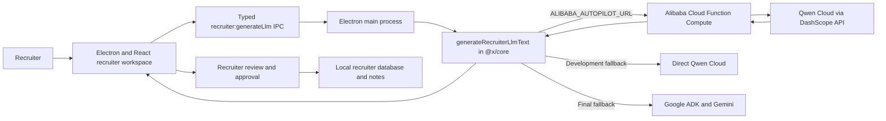

# Qwen Cloud Hackathon Track 4: Autopilot Agent

## Submission positioning

Jobraker Recruiter is a review-first Autopilot Agent for lean hiring teams. It turns a vague hiring need into a structured recruiting workflow covering candidate intake, enrichment, screening, outreach drafting, and interview scheduling recommendations.

**Track:** Track 4 — Autopilot Agent

## Demo workflow

1. The recruiter opens the Founding Full Stack Engineer role.
2. The agent imports or enriches candidate profiles from partial or LinkedIn-style inputs.
3. Qwen evaluates each candidate against the role and explains the evidence.
4. The recruiter reviews the recommendation before candidate-facing action.
5. The agent drafts personalized outreach and interview questions.
6. The recruiter approves outreach or scheduling through the existing product checkpoints.

## Why this fits Track 4

- **Ambiguous input handling:** Partial candidate information becomes a structured recruiter record.
- **External tool readiness:** The app includes Gmail, Google Calendar, Composio, search, and candidate-enrichment surfaces.
- **Human checkpoints:** Candidate-facing outreach and scheduling remain recruiter-approved.
- **Production-oriented state:** Candidate records, pipeline stages, notes, scheduled work, and local knowledge persist outside the model conversation.

## Implemented Alibaba Cloud and Qwen architecture



### Runtime behavior

`generateRecruiterLlmText()` uses this priority order:

1. **Alibaba Cloud Function Compute** when `ALIBABA_AUTOPILOT_URL` is configured.
2. **Direct Qwen Cloud** when only `DASHSCOPE_API_KEY` is configured, for local development.
3. **Google ADK/Gemini** when neither Alibaba setting is configured.

The production hackathon demo should use option 1 so the recruiter AI request demonstrably runs through Alibaba Cloud.

## Primary proof files

- `backend/alibaba-qwen-autopilot/server.mjs`
  - Function Compute HTTP service.
  - Calls the Qwen Cloud OpenAI-compatible API.
  - Exposes health, generic recruiter generation, and structured Autopilot endpoints.
- `backend/alibaba-qwen-autopilot/s.yaml`
  - Function Compute deployment configuration for `ap-southeast-1`.
  - Configures Qwen and service-authentication environment variables.
- `apps/x/packages/core/src/models/models.ts`
  - Routes the existing recruiter runtime through Function Compute when configured.
- `apps/x/apps/main/src/ipc.ts`
  - Existing typed `recruiter:generateLlm` desktop boundary.
- `apps/x/apps/renderer/src/components/recruiter/candidates-page.tsx`
  - Candidate evaluation and Qwen Autopilot interaction.

## Environment configuration

### Function Compute

```powershell
$env:DASHSCOPE_API_KEY="sk-your-qwen-cloud-key"
$env:AUTOPILOT_SERVICE_KEY="a-long-random-service-secret"
```

Optional model configuration:

```powershell
$env:DASHSCOPE_BASE_URL="https://dashscope-intl.aliyuncs.com/compatible-mode/v1"
$env:DASHSCOPE_MODEL="qwen3.7-plus"
```

### Jobraker Recruiter desktop app

```powershell
$env:ALIBABA_AUTOPILOT_URL="https://your-function-compute-trigger-url"
$env:ALIBABA_AUTOPILOT_SERVICE_KEY="the-same-long-random-service-secret"
```

The desktop application does not need the Qwen API key when it is using the deployed Function Compute service.

## Deployment

```powershell
cd backend/alibaba-qwen-autopilot
npm install
npm install -g @serverless-devs/s
s config add
$env:DASHSCOPE_API_KEY="sk-your-qwen-cloud-key"
$env:AUTOPILOT_SERVICE_KEY="a-long-random-service-secret"
s deploy -y
```

After deployment:

1. Copy the generated HTTP trigger URL.
2. Open `<trigger-url>/health` and verify:
   - `cloud` is `Alibaba Cloud Function Compute`.
   - `hasDashscopeKey` is `true`.
   - `serviceAuthenticationEnabled` is `true`.
3. Configure the desktop application environment variables.
4. Restart Jobraker Recruiter so the Electron main process receives them.
5. Run candidate analysis or **Run Qwen Autopilot**.
6. Capture the Function Compute invocation logs.

## Three-minute demo outline

- **0:00–0:20:** Explain recruiting fragmentation for lean teams.
- **0:20–0:45:** Show the open role and candidate pipeline.
- **0:45–1:20:** Import or open a candidate and show structured evidence.
- **1:20–1:55:** Run Qwen Autopilot and show the recommendation.
- **1:55–2:25:** Draft outreach and demonstrate recruiter approval before sending.
- **2:25–2:45:** Show interview scheduling or question preparation.
- **2:45–3:00:** Show the architecture and Alibaba Cloud Function Compute logs.

## Devpost proof package

- Public repository with an OSI-approved licence at the root.
- Code-file URL pointing to `backend/alibaba-qwen-autopilot/server.mjs`.
- Screenshot of the Function Compute service and its region.
- Screenshot of a successful `/health` response.
- Screenshot of invocation logs corresponding to the recorded app demo.
- Architecture diagram showing Electron → Function Compute → Qwen Cloud.
- Public demo video of approximately three minutes.
- Track selection: **Track 4 — Autopilot Agent**.

## Submission description

Jobraker Recruiter is a review-first Autopilot Agent for lean hiring teams. It automates the workflow from role intake to candidate screening, personalized outreach, and interview scheduling recommendations while keeping a recruiter in control of high-impact decisions. The Electron desktop application sends recruiter-native AI work through an Alibaba Cloud Function Compute backend, which uses Qwen Cloud for candidate evaluation and workflow reasoning. The system converts partial candidate information into structured records, scores fit against an open role, explains its evidence, drafts outreach, prepares interview actions, and preserves recruiter approval before external communication or scheduling.
