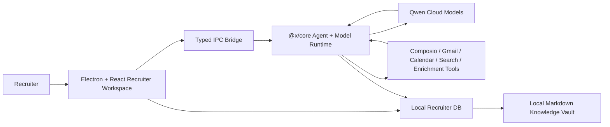

# Qwen Cloud Hackathon Track 4: Autopilot Agent

## Submission Positioning

Jobraker Recruiter is an Autopilot Agent for lean hiring teams. It turns a vague hiring need into a reviewable recruiting workflow: candidate intake, enrichment, screening, outreach drafting, and interview scheduling recommendations.

Track: **Track 4 - Autopilot Agent**

Demo workflow:

1. Recruiter opens the Founding Full Stack Engineer role.
2. Agent imports or enriches candidate profiles from LinkedIn-style inputs.
3. Agent scores each candidate against the role and explains the evidence.
4. Recruiter reviews the recommendation and approves outreach.
5. Agent drafts personalized outreach and prepares interview questions.
6. Recruiter approves scheduling, keeping a human checkpoint before external action.

## Why This Fits Track 4

The Track 4 prompt asks for agents that automate real-world business workflows end-to-end, handle ambiguous inputs, invoke tools, and include human-in-the-loop checkpoints. Recruiting is a high-value workflow where full automation without review is risky, so the product emphasizes review-first automation.

Core Track 4 claims:

- **Ambiguous input handling:** pasted candidate links or partial candidate details become structured candidate records.
- **External tool readiness:** app already has Composio, Gmail, Google Calendar, LinkedIn enrichment, and search integration surfaces.
- **Human checkpoints:** outreach and scheduling are drafted first, then approved by the recruiter.
- **Production-readiness:** local-first candidate database, typed IPC, persisted recruiter state, audit-friendly candidate notes, and separate UI states for sourcing, screening, pipeline, outreach, and interviews.

## Demo Dataset

The demo seed includes:

- Role: Founding Full Stack Engineer
- Candidates:
  - Amara Okafor: strongest match, already ready for interview.
  - Daniel Mensah: strong workflow automation background, in screening.
  - Nora Williams: strong AI safety/evaluation background, in review.

These are intentionally staged across the pipeline so the demo can show the Autopilot Agent moving work forward instead of only displaying static records.

## Qwen Cloud Integration Plan

Before final submission, connect the recruiter LLM path to Qwen Cloud using the existing provider configuration pattern rather than changing the app architecture.

Technical resources:

- Qwen Cloud first API call: https://bit.ly/qwencloud-first-api
- Qwen Cloud introduction: https://bit.ly/intro-qwencloud
- Qwen Cloud free quota signup: https://docs.qwencloud.com/resources/free-quota#get-the-free-quota
- Build session recording: https://www.youtube.com/watch?v=EhWA6OlMcRQ
- Build session FAQ and proof of deployment guide: https://docs.google.com/document/d/1XsiewMDMOGKxWGp7PRlaEnB7hN5n2JNIUho7cDIV8Vo/edit?usp=sharing
- Alibaba resource guide: https://drive.google.com/file/d/17Lj78J3NsL0vx1_mQGTLDyThkAkq8org/view?usp=sharing
- Technical support: https://bit.ly/qwencloud-support
- Technical questions: global.hackathon@alibaba-inc.com

Free quota notes:

- Sign up for Qwen Cloud to activate the free quota.
- No payment method is required for initial free quota activation.
- Free quota is typically valid for 90 days.
- Free quota offsets real-time model inference calls only.
- It does not offset batch calls, built-in tool-call fees, fine-tuning, model deployment, or custom deployed models.
- Use the Free Tier page to check remaining quota before recording the demo.
- Enable "Free quota only" where available to avoid accidental charges.

Recommended implementation:

1. Implemented: recruiter AI generation uses Qwen Cloud's OpenAI-compatible endpoint whenever `DASHSCOPE_API_KEY` is present in the Electron main-process environment.
2. Set the Qwen Cloud base URL to `https://dashscope-intl.aliyuncs.com/compatible-mode/v1`.
3. Store the API key in `DASHSCOPE_API_KEY` or local app config only.
3. Keep model names configurable; do not hard-code secrets.
4. Capture proof in code by linking to the provider configuration and the callsite used by recruiter screening/outreach.
5. Demo flow: open Candidates, select a candidate, and click `Run Qwen Autopilot` in the candidate detail panel.

Suggested local model provider setup:

```json
{
  "provider": {
    "flavor": "openai-compatible",
    "apiKey": "<DASHSCOPE_API_KEY>",
    "baseURL": "https://dashscope-intl.aliyuncs.com/compatible-mode/v1"
  },
  "model": "qwen3.7-plus"
}
```

Suggested environment variable:

```powershell
$env:DASHSCOPE_API_KEY = "sk-your-qwen-cloud-key"
```

Primary callsites:

- `apps/x/packages/core/src/models/models.ts`
- `apps/x/apps/main/src/ipc.ts`
- `apps/x/apps/renderer/src/components/recruiter/index.tsx`
- `apps/x/apps/renderer/src/components/recruiter/candidates-page.tsx`
- `backend/alibaba-qwen-autopilot/server.mjs`

Alibaba Cloud deployment proof file:

- Use `backend/alibaba-qwen-autopilot/server.mjs` as the code-file URL in the hackathon form. It is a server-side backend endpoint that calls Qwen Cloud through Alibaba's DashScope OpenAI-compatible API.

Qwen Cloud usage proof to show judges:

- The model provider config uses the Qwen Cloud OpenAI-compatible base URL.
- Recruiter screening calls `recruiter:generateLlm` through typed IPC.
- Candidate scoring and outreach prompts are visible in the recruiter UI code.
- Demo video shows the model-generated screening/outreach output in the product.

## Architecture



## Three-Minute Demo Script

0:00 - 0:20: Show the problem. Lean teams lose candidates across LinkedIn, inboxes, calendars, and spreadsheets.

0:20 - 0:50: Open Jobraker Recruiter and show the Founding Full Stack Engineer role.

0:50 - 1:20: Show candidate intake/enrichment. Explain that pasted candidate data becomes structured records with skills, experience, match score, startup fit, and notes.

1:20 - 1:50: Open the candidate detail panel. Show evidence-based fit scoring and the human-readable recommendation.

1:50 - 2:20: Draft outreach. Show that the agent produces personalized outreach but does not send without recruiter approval.

2:20 - 2:45: Move to interview scheduling. Show interview questions and the scheduling checkpoint.

2:45 - 3:00: Close with architecture: Qwen Cloud model reasoning, local-first records, external tool integrations, and review-first automation.

## Devpost Checklist

- Sign up for Qwen Cloud free quota
- Create Qwen Cloud API key
- Store the API key locally as `DASHSCOPE_API_KEY`
- Public source repository
- Open-source license at repository root
- Architecture diagram
- Three-minute public demo video
- Track selected: Track 4 Autopilot Agent
- Text description emphasizing business workflow automation
- Proof of Alibaba/Qwen Cloud usage in code
- Proof that backend is deployed/running on Alibaba Cloud
- Link to Qwen Cloud provider configuration or deployment environment variable example
- Link to Alibaba Cloud deployment proof following the official proof guide

## Proof of Deployment Plan

The hackathon requires evidence that the backend is running on Alibaba Cloud. The proof should be concrete and easy for judges to verify.

Recommended proof package:

1. Deploy a small backend/API wrapper or app service to Alibaba Cloud.
2. Configure the service with `DASHSCOPE_API_KEY` as a secret environment variable.
3. Expose a health or demo endpoint that performs a Qwen Cloud model call for a recruiter screening prompt.
4. Add a repository file showing:
   - Alibaba Cloud service configuration or deployment instructions.
   - Qwen Cloud base URL usage.
   - Environment variable name, without the secret value.
5. Include screenshots or console output from Alibaba Cloud showing the running service.
6. Add the deployment URL and proof file link to the Devpost submission.

Minimal proof endpoint idea:

```text
POST /api/recruiter-screen
Input: role + candidate profile
Output: match score, startup fit score, reasoning summary, recommended next action
Runtime: Alibaba Cloud
Model: Qwen Cloud via OpenAI-compatible endpoint
```

## Submission Description Draft

Jobraker Recruiter is a review-first Autopilot Agent for lean recruiting teams. It automates the workflow from role intake to candidate screening, personalized outreach, and interview scheduling recommendations while keeping a recruiter in control of high-impact decisions. The system converts partial candidate information and LinkedIn-style profile inputs into structured candidate records, scores fit against an open role, explains the evidence, drafts outreach, prepares interview questions, and updates the recruiting pipeline. Built for Track 4, the project focuses on production-ready workflow automation: persistent local records, typed app boundaries, tool integration surfaces, and human approval checkpoints before communication or scheduling actions.
