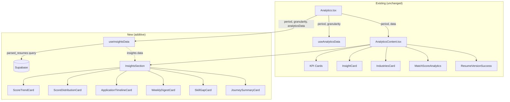

# Design Document: Analytics Insights

## Overview

This feature adds six new insight cards to the existing Analytics page (`/analytics`), providing deeper data-driven views of a user's job search journey. The implementation is **purely additive** — no existing components, hooks, or styles are modified.

The six new cards are:

1. **ScoreTrendCard** — line chart of average match score over time by granularity bucket
2. **ScoreDistributionCard** — bar chart / histogram of match scores across quality buckets (90–100, 75–89, 60–74, <60)
3. **ApplicationTimelineCard** — vertical timeline of the 20 most recent application milestones
4. **WeeklyDigestCard** — summary of the most recent complete calendar week with week-over-week deltas
5. **SkillGapCard** — top 10 skills found in job listings but missing from the user's parsed resume
6. **JourneySummaryCard** — plain-language narrative paragraph summarising the user's journey

All derived data is computed by a new `useInsightsData` hook that consumes the existing `useAnalyticsData` output plus a single additional Supabase query for `parsed_resumes`. The cards are rendered inside a new `InsightsSection` wrapper appended at the bottom of `AnalyticsContent.tsx`.

### Design Decisions

| Decision | Rationale |
|---|---|
| Separate `useInsightsData` hook | Keeps new logic isolated; existing hook return shape is untouched. |
| Accept `useAnalyticsData` output as a parameter | Avoids duplicate Supabase queries for `applications` and `jobs`. |
| Client-side narrative generation (no AI call) | Requirement 6.2 explicitly forbids external AI services; template-based generation is deterministic and testable. |
| Extract skills from `jobs.raw_data` via keyword matching | `raw_data` already contains match insights; skill keywords can be extracted from `raw_data.match_insights.summary` and the job `title`. |
| Reuse existing `Card` component and Tailwind patterns | Matches visual consistency with `MatchScoreAnalytics`, `IndustriesCard`, etc. |

---

## Architecture



### Data Flow

1. `Analytics.tsx` calls `useAnalyticsData(period, { granularity })` — **unchanged**.
2. `Analytics.tsx` calls `useInsightsData(period, granularity, analyticsData)` — **new**.
3. `useInsightsData` receives the raw applications/jobs arrays already fetched by `useAnalyticsData` (via the `data` object's snapshot or by re-reading from the same Supabase cache). It also issues one additional query for `parsed_resumes`.
4. `AnalyticsContent.tsx` receives the insights data and renders `<InsightsSection>` after the existing cards.
5. Each card receives its slice of the insights data as props.

### Integration Point

The only modification to an existing file is **appending** the `<InsightsSection>` component at the bottom of `AnalyticsContent.tsx`'s JSX return. No existing props, imports, or logic are changed.

`Analytics.tsx` gains one new hook call (`useInsightsData`) and passes the result down alongside the existing `data` prop.

---

## Components and Interfaces

### New Hook: `useInsightsData`

**File:** `src/hooks/useInsightsData.ts`

```typescript
type Period = "7d" | "30d" | "90d" | "ytd" | "12m";
type Granularity = "day" | "week" | "month";

interface ScoreTrendPoint {
  label: string;       // granularity bucket label (e.g. "Jan 15", "Wk 03 25")
  timestamp: number;
  avgScore: number;    // average match score for this bucket
  count: number;       // number of scored items in this bucket
}

interface ScoreDistributionBucket {
  range: string;       // "90–100" | "75–89" | "60–74" | "<60"
  count: number;
  percentage: number;  // 0–100
  color: string;
}

interface TimelineEvent {
  id: string;
  jobTitle: string;
  company: string | null;
  status: string;
  matchScore: number | null;
  date: string;        // ISO date string
  isStatusChange: boolean;
}

interface WeeklyDigest {
  weekLabel: string;           // e.g. "Dec 9 – Dec 15"
  applications: number;
  jobsDiscovered: number;
  interviews: number;
  avgMatchScore: number;
  deltas: {
    applications: number;      // percentage delta vs prior week
    jobsDiscovered: number;
    interviews: number;
    avgMatchScore: number;     // absolute delta
  };
}

interface SkillGapItem {
  skill: string;
  frequency: number;          // count of job listings mentioning this skill
}

interface InsightsData {
  scoreTrend: ScoreTrendPoint[];
  overallAvgScore: number;
  scoreDelta: number;          // delta vs previous period
  scoreDistribution: ScoreDistributionBucket[];
  timeline: TimelineEvent[];
  weeklyDigest: WeeklyDigest | null;
  skillGaps: SkillGapItem[];
  hasResume: boolean;
  journeyNarrative: string;
  loading: boolean;
  error: string | null;
}

function useInsightsData(
  period: Period,
  granularity: Granularity,
  analyticsData: ReturnType<typeof useAnalyticsData>,
): InsightsData;
```

### New Components

All new components live under `src/components/analytics/insights/`.

| Component | File | Props |
|---|---|---|
| `InsightsSection` | `InsightsSection.tsx` | `{ period, insights }` |
| `ScoreTrendCard` | `ScoreTrendCard.tsx` | `{ scoreTrend, overallAvgScore, scoreDelta, period, loading }` |
| `ScoreDistributionCard` | `ScoreDistributionCard.tsx` | `{ scoreDistribution, period, loading }` |
| `ApplicationTimelineCard` | `ApplicationTimelineCard.tsx` | `{ timeline, period, loading }` |
| `WeeklyDigestCard` | `WeeklyDigestCard.tsx` | `{ weeklyDigest, loading }` |
| `SkillGapCard` | `SkillGapCard.tsx` | `{ skillGaps, hasResume, loading }` |
| `JourneySummaryCard` | `JourneySummaryCard.tsx` | `{ narrative, period, loading }` |

### Component Conventions (matching existing cards)

- Wrap content in `<motion.div>` with `initial={{ opacity: 0, y: 20 }}` / `animate={{ opacity: 1, y: 0 }}`.
- Use the `<Card>` component from `src/components/ui/card.tsx`.
- Use Recharts (`LineChart`, `BarChart`, `ResponsiveContainer`) for charts.
- Use Lucide React icons for decorative badges.
- Use Tailwind utility classes matching the existing palette (`#1dff00`, `#56c2ff`, `#f59e0b`, etc.).
- Display an empty-state `<div>` with dashed border when no data is available.

### Modified Files (additive only)

| File | Change |
|---|---|
| `Analytics.tsx` | Add `useInsightsData` call; pass `insights` to `AnalyticsContent`. |
| `AnalyticsContent.tsx` | Import and render `<InsightsSection>` after existing cards. |

---

## Data Models

### Supabase Tables (existing, read-only)

**`applications`**
| Column | Type | Usage |
|---|---|---|
| `id` | uuid | Primary key |
| `applied_date` | date \| null | Primary date for timeline/trend |
| `created_at` | timestamptz | Fallback date when `applied_date` is null |
| `status` | text | Timeline milestone, weekly digest |
| `updated_at` | timestamptz | Status-change milestone date |
| `user_id` | uuid | Row-level filter |
| `match_score` | numeric \| null | Fallback match score |
| `notes` | text \| null | Legacy match score extraction via regex |

**`jobs`**
| Column | Type | Usage |
|---|---|---|
| `id` | uuid | Primary key |
| `created_at` | timestamptz | Timeline date, weekly digest |
| `source_type` | text | Journey narrative "most active source" |
| `user_id` | uuid | Row-level filter |
| `title` | text | Timeline display, skill extraction |
| `company` | text | Timeline display |
| `raw_data` | jsonb | `raw_data.match_insights.score` for match scores; `raw_data.match_insights.summary` for skill keyword extraction |

**`parsed_resumes`**
| Column | Type | Usage |
|---|---|---|
| `resume_id` | uuid | FK to resumes |
| `user_id` | uuid | Row-level filter |
| `skills` | text[] | User's known skills for gap analysis |

### Derived Data Structures

**Score Trend Computation:**
1. Collect all match scores (from `jobs.raw_data.match_insights.score` with fallback to `applications.match_score`).
2. Assign each score to a granularity bucket (day/week/month) based on the item's date.
3. Compute the average score per bucket → `ScoreTrendPoint[]`.

**Score Distribution Computation:**
1. Collect all match scores within the period.
2. Bucket into four ranges: 90–100, 75–89, 60–74, <60.
3. Compute count and percentage per bucket → `ScoreDistributionBucket[]`.

**Timeline Computation:**
1. For each application, create an event from `applied_date` (or `created_at`).
2. If `updated_at > applied_date` and status is not the initial status, create a second "status change" event.
3. Join with the corresponding job record to get `title` and `company`.
4. Sort newest-first, take top 20 → `TimelineEvent[]`.

**Weekly Digest Computation:**
1. Determine the most recent complete calendar week (Monday–Sunday).
2. Filter applications and jobs within that week.
3. Compute metrics (applications, jobs discovered, interviews, avg match score).
4. Repeat for the prior week and compute deltas → `WeeklyDigest`.

**Skill Gap Computation:**
1. Fetch user's `parsed_resumes.skills` (lowercased set).
2. Extract skill keywords from `jobs.raw_data.match_insights.summary` and `jobs.title` within the period.
3. Filter out skills already in the user's set.
4. Rank by frequency, take top 10 → `SkillGapItem[]`.

**Journey Narrative Computation:**
1. Use computed metrics (total applications, interview rate, top match score, most active source, trend direction).
2. Fill a template string with 3–5 sentences → `string`.


---

## Correctness Properties

*A property is a characteristic or behavior that should hold true across all valid executions of a system — essentially, a formal statement about what the system should do. Properties serve as the bridge between human-readable specifications and machine-verifiable correctness guarantees.*

### Property 1: Score trend bucketing preserves all scores

*For any* array of `{date, score}` items and any valid granularity (day/week/month), computing the score trend SHALL produce buckets where the sum of all bucket `count` values equals the number of input items with scores, and each bucket's `avgScore` equals the arithmetic mean of the scores assigned to that bucket.

**Validates: Requirements 1.1**

### Property 2: Overall average score and period delta are correct

*For any* two arrays of match scores (current period and previous period), the computed `overallAvgScore` SHALL equal the arithmetic mean of the current period scores (rounded to the nearest integer), and `scoreDelta` SHALL equal `overallAvgScore - previousAvgScore`.

**Validates: Requirements 1.3**

### Property 3: Score distribution bucketing with correct counts and percentages

*For any* array of match scores (integers 0–100), the distribution computation SHALL assign each score to exactly one of the four buckets (90–100, 75–89, 60–74, <60), the sum of all bucket counts SHALL equal the input array length, and each bucket's percentage SHALL equal `Math.round((bucket.count / total) * 100)`.

**Validates: Requirements 2.1, 2.2**

### Property 4: Timeline is sorted, capped, and complete

*For any* array of application objects with dates and associated job data, the timeline computation SHALL produce events sorted by date in descending order (newest-first), the output length SHALL be at most 20, and every event SHALL contain non-undefined values for `jobTitle`, `status`, and `date`.

**Validates: Requirements 3.1, 3.2**

### Property 5: Status changes produce distinct timeline milestones

*For any* application where `updated_at` is strictly later than `applied_date` (or `created_at`) and the status is not the initial default, the timeline computation SHALL produce at least two events for that application: one with the original date and one with the `updated_at` date.

**Validates: Requirements 3.3**

### Property 6: Weekly digest selects correct week with accurate metrics and deltas

*For any* set of applications and jobs with dates spanning at least two complete calendar weeks, the weekly digest computation SHALL select the most recent complete Monday–Sunday week, the reported `applications` count SHALL equal the number of applications within that week, and each delta SHALL equal the percentage change from the prior week's corresponding metric (or absolute change for `avgMatchScore`).

**Validates: Requirements 4.1, 4.2**

### Property 7: Skill gaps are absent from user skills, frequency-ordered, and capped

*For any* user skill set and any array of job-listing skill sets, the skill gap computation SHALL return only skills that are NOT in the user's skill set, the results SHALL be ordered by descending frequency, and the output length SHALL be at most 10.

**Validates: Requirements 5.1, 5.2**

### Property 8: Journey narrative contains all required data points

*For any* metrics object with `totalApplications > 0`, the generated narrative string SHALL contain the total applications count, the interview rate (as a percentage or fraction), the top match score, the most active source name, and a trend direction indicator (e.g., "improving", "declining", "steady").

**Validates: Requirements 6.1**

---

## Error Handling

| Scenario | Handling |
|---|---|
| `useInsightsData` Supabase query for `parsed_resumes` fails | Set `error` state with message; cards that depend on resume data (`SkillGapCard`) show error state; other cards render normally from analytics data. |
| `analyticsData` is still loading | `useInsightsData` sets its own `loading: true`; all insight cards show skeleton/loading state. |
| `analyticsData.error` is non-null | `useInsightsData` propagates a combined error; cards show empty states. |
| No match scores in period | `ScoreTrendCard` and `ScoreDistributionCard` show empty-state messages. `overallAvgScore` defaults to 0, `scoreDelta` defaults to 0. |
| No applications in period | `ApplicationTimelineCard` shows empty-state. `WeeklyDigestCard` returns `null` digest. `JourneySummaryCard` shows empty-state. |
| No parsed resume for user | `SkillGapCard` shows "upload a resume" prompt. `hasResume` is `false`. |
| User skills superset of job skills | `SkillGapCard` shows positive-feedback "strong alignment" message. |
| `raw_data` is null or malformed on a job | Score extraction returns `null`; item is excluded from score-based computations. No error thrown. |
| Fewer than 2 trend buckets with data | `ScoreTrendCard` shows empty-state message instead of chart. |
| No complete calendar week in data | `WeeklyDigestCard` returns `null` digest; card shows empty-state. |
| Component unmounts during async fetch | Abort controller cancels in-flight `parsed_resumes` query; no state updates after unmount. |

---

## Testing Strategy

### Unit Tests (example-based)

Unit tests cover specific scenarios, edge cases, and integration points:

| Test | What it verifies |
|---|---|
| `useInsightsData` returns loading/error states | Hook exposes independent `loading` and `error` (Req 7.4) |
| Empty data produces empty states for all cards | Each card renders empty-state when given no data (Reqs 1.2, 2.3, 3.4, 4.3, 6.3) |
| `SkillGapCard` shows upload prompt when `hasResume=false` | Req 5.3 |
| `SkillGapCard` shows positive message when no gaps | Req 5.4 |
| `InsightsSection` renders after existing cards | Req 8.1 |
| Narrative generation produces no external API calls | Req 6.2 — verify function is synchronous and pure |
| Malformed `raw_data` does not crash computation | Defensive handling of null/undefined `raw_data.match_insights` |

### Property-Based Tests

Property-based tests use **fast-check** (the standard PBT library for TypeScript/JavaScript) to verify universal properties across randomly generated inputs. Each property test runs a minimum of **100 iterations**.

| Property | Test Tag |
|---|---|
| Property 1: Score trend bucketing | `Feature: analytics-insights, Property 1: Score trend bucketing preserves all scores` |
| Property 2: Overall average and delta | `Feature: analytics-insights, Property 2: Overall average score and period delta are correct` |
| Property 3: Score distribution | `Feature: analytics-insights, Property 3: Score distribution bucketing with correct counts and percentages` |
| Property 4: Timeline sorted and capped | `Feature: analytics-insights, Property 4: Timeline is sorted, capped, and complete` |
| Property 5: Status change milestones | `Feature: analytics-insights, Property 5: Status changes produce distinct timeline milestones` |
| Property 6: Weekly digest | `Feature: analytics-insights, Property 6: Weekly digest selects correct week with accurate metrics and deltas` |
| Property 7: Skill gaps | `Feature: analytics-insights, Property 7: Skill gaps are absent from user skills, frequency-ordered, and capped` |
| Property 8: Journey narrative | `Feature: analytics-insights, Property 8: Journey narrative contains all required data points` |

### Test Configuration

- **Library**: `fast-check` (npm package)
- **Runner**: `vitest` (aligns with Vite-based project)
- **Minimum iterations**: 100 per property
- **Test location**: `src/__tests__/insights/` directory
- **Each property test references its design document property number in a comment tag**

### What Is NOT Tested with PBT

- UI rendering and animations (Framer Motion entrance, Recharts chart rendering) — use snapshot tests
- Supabase query execution — use integration tests with mocked Supabase client
- React hook lifecycle (loading/error state transitions) — use example-based tests with React Testing Library
- Architectural constraints (additive-only, no existing file modifications) — verified by code review
