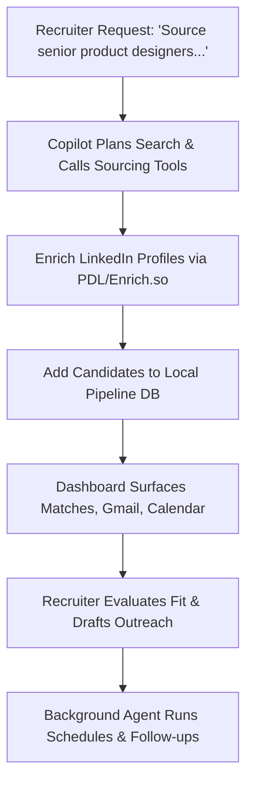

<h1 align="center">Jobraker Recruiter</h1>

<p align="center">
  <strong>AI recruiting for lean teams — source, screen, and outreach without the headcount.</strong>
</p>

---

## 📖 Table of Contents
1. [Inspiration](#-inspiration)
2. [Problem to Solve](#-problem-to-solve)
3. [Our Solution](#-our-solution)
4. [Key Features](#-key-features)
5. [Typical Workflow](#-typical-workflow)
6. [How the Agent Functions](#-how-the-agent-functions)
7. [Google Cloud & AI ADK Integration](#-google-cloud--ai-adk-integration)
8. [Application Stack & Integrations](#-application-stack--integrations)
9. [Data Sources & Privacy Model](#-data-sources--privacy-model)
10. [Local Development & Setup](#-local-development--setup)
11. [Findings, Learnings & Accomplishments](#-findings-learnings--accomplishments)
12. [What's Next](#-whats-next)
13. [Team & Credits](#-team--credits)
14. [License](#-license)

---

## 💡 Inspiration

Someone can spend years building hiring intuition — who fits a seed-stage team, how to read a portfolio, what makes outreach feel human, which signals matter for a founding engineer vs. a senior PM. They know the roles they need to fill, the candidates they want to reach, the follow-ups that should have gone out last week, and the story they want every hire to understand about the company.

But then they open a blank ATS, a spreadsheet, or a chain of disconnected tabs — LinkedIn, Gmail, Calendar, notes, job descriptions — and the work often dies at the first blank screen.

Jobraker Recruiter applies the principle that the translation layer between imagination and artifact has to be inspectable. The assistant must not only answer — it must leave behind editable records, visible pipeline state, and notes the recruiter can trust.

---

## 🔍 Problem to Solve

Lean hiring teams — founders acting as hiring managers, solo recruiters, and early-stage startups — face the same bottleneck that enterprise ATS products were built for headcount to solve. They can describe the ideal candidate clearly, but the work fragments across LinkedIn, Gmail, spreadsheets, calendars, and notes that never compound. Every new search starts cold. Context lives in tabs and inboxes, not in a system the team owns.

Before there is a qualified pipeline, there are barriers: expensive recruiting software, manual copy-paste between tools, no shared memory across searches, and AI products that hide context inside opaque databases instead of letting recruiters inspect or own their work. The first lesson is not judgment. It is setup friction.

This pattern repeats quietly. A founder is also the hiring manager. A lean startup has one recruiter doing sourcing, screening, scheduling, and outreach alone. A community organization wants to run a fair search but cannot afford a full recruiting stack. The deeper issue is not a lack of talent in the market. It is the production gap between *knowing who you want to hire* and *running a living pipeline* that compounds over time.

The access gap is not only about connectivity. It is about whether smaller teams get the same leverage larger organizations buy with headcount and software budgets. Jobraker Recruiter was built for that gap: a local-first AI copilot that turns natural-language hiring intent into inspectable pipeline artifacts, with hiring memory that grows on the recruiter's machine as plain Markdown.

---

## 🚀 Our Solution

**Jobraker Recruiter** is a local-first Electron desktop copilot for lean recruiting teams. Instead of leaving recruiters alone with disconnected tabs and empty trackers, an AI agent reasons over the user's request, loads domain skills, calls structured tools, reads local knowledge, and helps produce inspectable recruiting artifacts: candidate records, role briefs, outreach drafts, meeting notes, and pipeline state.

### Key Features
* **Home Command Center**: Live KPIs (open roles, active searches, response rate), top matches by fit score, Gmail inbox, and Google Calendar agenda.
* **Recruiter Workspace**: Dashboards for Roles, Candidates, Pipeline (Kanban board), Sourcing (LinkedIn enrichment queue), and Analytics.
* **Agentic Copilot**: Chat-driven sourcing, screening, outreach drafting, and in-app navigation via typed tools.
* **Knowledge Vault**: Obsidian-compatible Markdown notes with backlinks, allowing hiring context to compound across searches.
* **Live Notes & Background Tasks**: Self-updating notes and scheduled agents for follow-ups, digests, and pipeline hygiene.
* **LinkedIn Enrichment**: Profile import via People Data Labs and Enrich.so with a sourcing queue and role assignment.

---

## 🔄 Typical Workflow



1. A recruiter asks: *"Source senior product designers in Lagos with 5+ years SaaS experience."*
2. The copilot plans the search, enriches LinkedIn profiles, and adds candidates to the local pipeline.
3. The home dashboard surfaces live KPIs, top matches, Gmail replies, and calendar interviews.
4. The recruiter opens a candidate, reviews fit signals, drafts outreach, and advances the stage.
5. Background agents keep sourcing or follow-up work running while the recruiter focuses on decisions.

---

## 🤖 How the Agent Functions

The assistant runs a bounded skill-and-tool loop:

$$\text{User Goal} \longrightarrow \text{Skill Selection} \longrightarrow \text{Tool Call} \longrightarrow \text{Structured Result} \longrightarrow \text{Refinement} \longrightarrow \text{Saved Artifact}$$

It can navigate the app UI, read and write local files, sync Gmail and Calendar, search the knowledge base, call MCP servers, execute Composio integrations, run background tasks, and control an embedded browser for authenticated sourcing. The output is a working recruiting system with roles, candidates, pipeline columns, analytics, and a knowledge vault that grows with every search.

For recruiter-native LLM tasks — candidate fit analysis, match scoring, startup-fit insights, and outreach drafting — Jobraker Recruiter uses **Google Agent Development Kit (ADK)** as a dedicated agent runtime, separate from the general copilot chat loop.

---

## ⚡ Google Cloud & AI ADK Integration

Jobraker Recruiter uses **Google Agent Development Kit (`@google/adk`)** as the intelligence runtime for recruiter-native LLM workflows. Rather than treating Gemini as a one-shot text API, ADK structures recruiting tasks as named agents with instructions, model bindings, and ephemeral execution sessions.

### How ADK is Used
Recruiter LLM calls flow through `generateRecruiterLlmText()` in `@x/core`, exposed to the desktop app via the `recruiter:generateLlm` IPC channel:
1. **`Gemini` Model Binding**: Connects to the user's Google AI API key and configured model (e.g. `gemini-2.5-flash`).
2. **`LlmAgent` (`RecruiterCompanion`)**: Carries the system instruction (role requirements, candidate context, output schema) as persistent agent configuration.
3. **`InMemoryRunner`**: Runs an ephemeral agent session (`appName: "JobrakerRecruiter"`) and streams structured events back to the main process.
4. **`stringifyContent`**: Aggregates streamed ADK events into the final recruiter-facing response (JSON fit scores, outreach copy, sourcing insights).

This pattern keeps recruiter prompts **agent-shaped** — instruction + user message + temperature — instead of ad-hoc string concatenation scattered across the UI.

### Where ADK Shows Up in the Product

| Workflow | ADK Role |
| :--- | :--- |
| **Candidate Fit Analysis** | `LlmAgent` evaluates a profile against an open role and returns structured `matchScore`, `startupFitScore`, and insights. |
| **Outreach Drafting** | Agent generates subject + body grounded in candidate skills, highlights, and role context. |
| **Sourcing Enrichment Follow-Up** | Post-enrichment analysis turns LinkedIn data into recruiter-ready summaries and fit signals. |

The main copilot chat loop uses the Vercel AI SDK with skills and tools; **ADK is the dedicated Google-native agent path for recruiter CRUD screens** that need reliable, schema-bound LLM output.

### Supporting Google Services
ADK sits alongside other Google Cloud integrations that feed the agent context:
* **Google Gemini API**: Model backend for the ADK `Gemini` class.
* **Google Gmail API**: Synced inbox threads on the home dashboard and outreach-aware workflows.
* **Google Calendar API**: Interview and meeting agenda for scheduling context.
* **Google Drive API**: Optional workspace file access.
* **Google OAuth 2.0**: User-authorized connector setup via Google Cloud Console.

> [!NOTE]
> For teams that prefer on-device inference, **Gemma via Ollama** remains supported for the broader copilot. Recruiter ADK workflows are optimized for **hosted Gemini** through the Google AI API.

---

## 🛠️ Application Stack & Integrations

### Application Stack
* **Desktop Shell**: Electron 39 (Main, Preload, Renderer)
* **Frontend UI**: React 19, TypeScript 5.9, Vite 7
* **Styling & Motion**: Tailwind CSS, Motion, Radix UI
* **Monorepo Structure**: `pnpm` workspaces (`@x/shared`, `@x/core`, preload, renderer, main)
* **Copilot Orchestration**: Vercel AI SDK
* **Validation**: Zod (IPC and domain schema validation)
* **Bundling & Packaging**: `esbuild` + Electron Forge

### Agent & Integration Layer
* **Model Context Protocol (MCP)**: External tool servers (including Elasticsearch)
* **Composio**: Third-party SaaS actions (Slack, Linear, GitHub, Notion, Jira, etc.)
* **Firecrawl**: `web-search` and `web-scrape` tools for web extraction
* **Elasticsearch**: Optional hybrid semantic retrieval for knowledge and candidate evidence
* **Product Telemetry**: PostHog (Optional)
* **Enrichment & Voice**: People Data Labs, Enrich.so, Deepgram (STT), ElevenLabs (TTS)

---

## 💾 Data Sources & Privacy Model

All recruiter and knowledge data defaults to **local-first storage** on the user's machine. External APIs are invoked only when the user configures keys and connectors.

| Source | Role |
| :--- | :--- |
| **Local Markdown Vault** (`~/.jobraker-recruiter/knowledge/`) | Primary knowledge base — notes, people, meetings, projects |
| **Recruiter DB** (`config/recruiter-db.json`) | Candidates, roles, pipeline board, stages, home metric snapshots |
| **Gmail Sync Cache** (`gmail_sync/`) | Synced email threads for inbox UI and live-note triggers |
| **Calendar Sync Cache** (`calendar_sync/`) | Google Calendar events for meetings and home agenda |
| **People Data Labs API** | LinkedIn profile enrichment (name, title, experience, skills, etc.) |
| **Enrich.so API** | Alternative LinkedIn enrichment provider |
| **Firecrawl API** | Web pages for sourcing research and company/candidate discovery |
| **Elasticsearch Indices** (optional) | Semantic search over workspaces, knowledge, bases, graph, candidates |
| **Google Gemini API (via ADK)** | Recruiter fit analysis, outreach drafting, and structured agent responses |
| **LLM Provider APIs** | OpenAI, Anthropic, OpenRouter, or local Ollama/Gemma for the main copilot |
| **Composio-Connected Services** | Live data from Gmail, Slack, GitHub, and other connected toolkits |

---

## ⚙️ Local Development & Setup

### Prerequisites
* **Node.js** (v18+)
* **pnpm** (Required for monorepo workspace resolution)

### Step-by-step Setup
```bash
# Clone the repository
git clone https://github.com/jobraker-recruiter/jobraker-recruiter.git
cd jobraker-recruiter

# Navigate to the Electron application root
cd apps/x

# Install package dependencies
pnpm install

# Compile monorepo packages sequentially (shared -> core -> preload)
npm run deps

# Launch the Vite dev server and boot Electron in development mode
npm run dev
```

> [!NOTE]
> Vite runs on `http://localhost:5173`. Main and Preload files do not hot-reload automatically. If you edit files under `apps/main/src` or `apps/preload/src`, restart the dev task by running `npm run dev`.

### Verification & Linting
Validate typescript compilation and eslint rules:
```bash
cd apps/x
npm run deps && npm run lint
cd apps/renderer
npx tsc --noEmit
```

### Packaging & Distribution
To package a production binary and build the Squirrel Windows installer (.exe):
```bash
cd apps/x/apps/main
npm run package
npm run make
```
*Installer outputs are written to `apps/x/apps/main/out/make/squirrel.windows/x64/`.*

---

## 📈 Findings, Learnings & Accomplishments

### Accomplishments We're Proud Of
* Built a full recruiter operating surface — Home, Sourcing, Candidates, Pipeline, Roles, and Analytics — inside a local-first Electron copilot.
* Replaced mock dashboard data with real persisted pipeline state, live KPI calculations, and weekly metric snapshots.
* Added LinkedIn enrichment through PDL and Enrich.so with API-key settings and a sourcing queue.
* Wired the home dashboard to real Gmail threads and synced Google Calendar events, not placeholder inbox/agenda cards.
* Designed an agentic architecture where the copilot can navigate the app, edit knowledge, run background tasks, and call external tools through MCP/Composio.
* Kept hiring memory transparent as Markdown in an Obsidian-compatible vault instead of hiding it in a proprietary database.

### Core Learnings & Findings
* **ADK fits recruiter workflows better than raw completion APIs**: Candidate evaluation and outreach need schema-bound output — match scores, fit insights, subject lines — not free-form prose. Wrapping Gemini in `LlmAgent` + `InMemoryRunner` gave a repeatable agent contract (`RecruiterCompanion`) that the UI and IPC layer can depend on.
* **Two LLM paths, one product**: The main copilot chat loop uses Vercel AI SDK with skills and tools for open-ended recruiting work. Recruiter screens use ADK for structured, high-stakes outputs. Splitting these paths kept each runtime optimized for its job.
* **Local-first changes the agent design**: Recruiting agents work better when every action leaves a file or record the user can open. Tool results, Markdown notes, and JSON pipeline state make the copilot auditable.
* **Skill boundaries beat one vague chatbot**: Recruiting spans sourcing, enrichment, screening, scheduling, outreach, and analytics. Typed skills (app navigation, draft emails, meeting prep, background tasks, MCP integration) with a bounded tool catalog produced more reliable behavior than a single general prompt.
* **Build pipeline order matters in monorepos**: The renderer depends on compiled `@x/shared` types. CI/CD failed until `shared` was built before TypeScript compilation in the renderer.

---

## 🔮 What's Next
* **Deeper Elasticsearch integration**: Hybrid retrieval for semantic candidate-role matching at scale.
* **Stronger background-agent templates** for sourcing, follow-up, and pipeline hygiene.
* **Richer outreach analytics** tied to real Gmail reply signals.
* **Full local-first model paths** for more recruiting workflows on Ollama / Gemma.
* **Team workspaces** with shared vault sync while preserving local ownership.
* **Broader enrichment providers** and resume parsing for faster candidate intake.

---

## 👥 Team & Credits
* **Miles** (Solo Builder) — Product design, AI workflow architecture, Google ADK integration, Electron + React implementation, recruiter UX, enrichment integrations, and demo preparation.

---

## 📄 License
Jobraker Recruiter is licensed under the [Apache 2.0 License](LICENSE).
