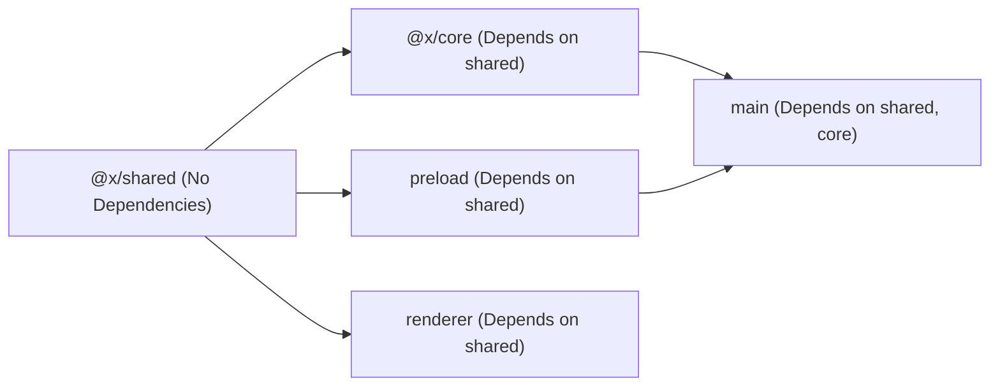
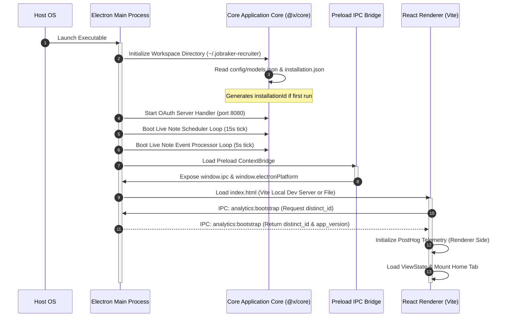
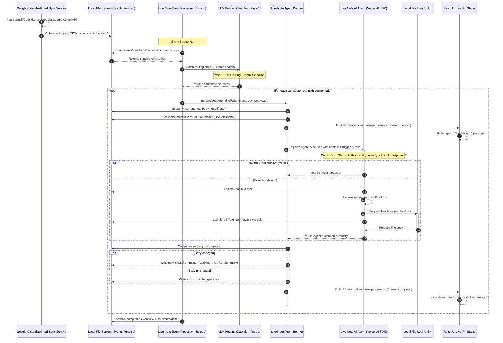
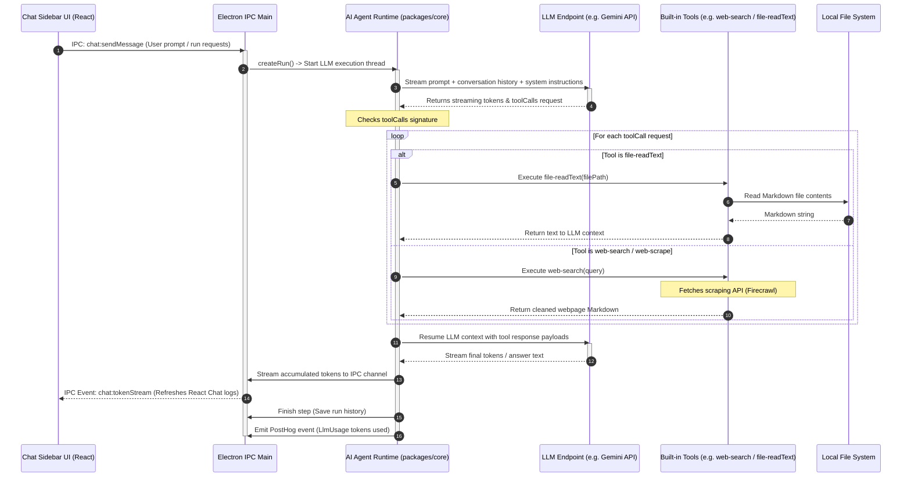

# Jobraker Recruiter - Architecture & System Design

Jobraker Recruiter is a local-first, AI-powered desktop copilot for recruiters and lean hiring teams. Built as a desktop application with Electron, it allows users to manage candidates, search profiles, run background tasks, and build a local knowledge base (Obsidian-compatible Markdown vault) while maintaining absolute data ownership on their local machine.

---

## 1. System Components at a Glance

The following C4-style diagram outlines the system boundaries, major containers, and communication protocols within the Jobraker Recruiter application:

```mermaid
graph TB
    %% Users and Interfaces
    User["Recruiter (User)"]
    
    subgraph Electron_App["Electron Desktop Application (apps/x)"]
        %% Renderer Container
        subgraph Renderer_Process["Renderer Process (React Shell)"]
            ReactUI["React 19 Components (Vite 7)"]
            UIState["ViewState & History Manager"]
            MarkdownEditor["Markdown Editor & Live Pill"]
            RecruiterModule["Recruiter UI (Roles, Candidates, Kanban, Analytics)"]
            MeetingsView["Meetings & Calendar UI"]
        end
        
        %% Preload Bridge
        Preload["Preload Script (ContextBridge IPC)"]
        
        %% Main Process Container
        subgraph Main_Process["Main Process (Node.js)"]
            ElectronMain["Electron Main Lifecycle (main.ts)"]
            IPCHandlers["IPC Router & Schema Validator"]
            OAuthHandler["OAuth Callback Handler (Port 8080)"]
            Scheduler["Live Note Scheduler Loop (15s tick)"]
            EventConsumer["Live Note Event Loop (5s tick)"]
            BackgroundQueue["Background Task Runner"]
        end
        
        %% Core Business Logic Package
        subgraph Core_Package["@x/core Package"]
            AIRuntime["AI Agent Runtime (Vercel AI SDK)"]
            MCPRegistry["MCP Server & Client Registry"]
            ElasticConnector["Elasticsearch Connector / Retrieval"]
            FileManager["Filesystem & Vault Manager (with locks)"]
            PostHogMain["PostHog Node.js Telemetry"]
        end
        
        %% Shared Schema Package
        Shared["@x/shared (IPC & Domain Schemas)"]
    end
    
    %% Local Storage & OS
    subgraph Local_Storage["Local Storage Layer"]
        Vault["Obsidian-compatible Vault (knowledge/*.md)"]
        JSONConfigs["Config Files (~/.jobraker-recruiter/config/*.json)"]
        EventStore["Pending Event Store (events/pending/*.json)"]
        SyncCache["Gmail/Calendar Local Sync JSONs"]
        BrowserStorage["LocalStorage (UI Mock Data & Persistence)"]
    end
    
    %% External Integrations
    subgraph External_Services["External Services & APIs"]
        LLMProviders["LLM Providers (Gemini, Ollama, OpenAI, Anthropic, OpenRouter)"]
        GoogleAPIs["Google Workspace APIs (Gmail, Calendar, Drive)"]
        ComposioAPI["Composio Engine (Slack, Linear, GitHub, CRMs)"]
        MCPServers["External MCP Servers (e.g. Exa search)"]
        PostHogCloud["PostHog Analytics Cloud"]
        VoiceAPIs["Voice APIs (Deepgram STT, ElevenLabs TTS)"]
    end

    %% Connections
    User -->|Interacts| ReactUI
    ReactUI --> UIState
    ReactUI --> MarkdownEditor
    ReactUI --> RecruiterModule
    ReactUI --> MeetingsView
    
    ReactUI <-->|Typed IPC calls| Preload
    Preload <-->|Secure IPC| IPCHandlers
    IPCHandlers <--> ElectronMain
    
    ElectronMain --> Core_Package
    IPCHandlers --> Core_Package
    Scheduler --> Core_Package
    EventConsumer --> Core_Package
    BackgroundQueue --> Core_Package
    
    Core_Package -.->|Imports schemas| Shared
    Renderer_Process -.->|Imports schemas| Shared
    
    %% Storage Reads/Writes
    FileManager <-->|Read/Write Lock| Vault
    FileManager <-->|Read/Write| JSONConfigs
    FileManager <-->|FIFO Queue| EventStore
    FileManager <-->|Cache Sync| SyncCache
    ReactUI <-->|Mock Data| BrowserStorage
    
    %% External API Traffic
    AIRuntime <-->|Vercel AI SDK| LLMProviders
    OAuthHandler <-->|Auth Code Grant| GoogleAPIs
    Core_Package <-->|Gmail/Calendar Sync| GoogleAPIs
    AIRuntime <-->|JSON Tools| ComposioAPI
    MCPRegistry <-->|Model Context Protocol| MCPServers
    PostHogMain -.->|Bulk Telemetry| PostHogCloud
    AIRuntime <-->|Audio Processing| VoiceAPIs
```

---

## 2. Monorepo Structure & Build Pipeline

The project is structured as a monorepo containing multiple packages and applications. The desktop application itself relies on a strict internal build order of shared packages.

### Workspace Directory Layout
* **`apps/x/`**: Electron application root.
  * **`apps/main/`**: Main process code, Forge configurations, and esbuild packaging scripts.
  * **`apps/preload/`**: The contextBridge bridge establishing secure, typed channels between main and renderer.
  * **`apps/renderer/`**: The React front-end, styled with TailwindCSS and custom CSS rules.
  * **`packages/shared/`**: Contains shared runtime schemas (Zod), IPC validator objects, and common types.
  * **`packages/core/`**: Houses key back-end operations (AI tools, scheduler ticks, local sync managers).
* **`apps/jobraker-recruiter/`** and **`apps/jobraker-recruiter-x/`**: Web dashboards.
* **`Jobraker/`**: Job-seeker facing interface.

### Build Dependencies & Compilation Order
Because packages are linked via pnpm workspaces, they must compile sequentially:

* **Build Tooling**: `pnpm` is utilized for workspace link management. The Main process is packaged by `esbuild` to produce a single, unified CommonJS file (`main.cjs`) which bypasses symlink traversing issues during Electron Forge package runs. The Renderer is bundled using `Vite 7` into standard HTML/JS assets.

---

## 3. High-Fidelity Data & Control Flows

Below are sequence diagrams representing the key operations of Jobraker Recruiter, illustrating how UI components, Electron processes, local files, and external APIs interact.

### Flow A: Bootstrapping & Lifecycle Initialization
When the user launches the application, the system registers local structures, synchronizes configurations, and hooks up the renderer.

### Flow B: Event-Driven "Live Notes" Synchronization Loop
Live Notes are dynamic Markdown files that automatically execute LLM queries and update their contents based on incoming triggers (Gmail synchronization, calendar changes, or cron schedules).

### Flow C: Direct Chat & Built-in Agent Tool Execution
When the user queries the docked Copilot sidebar in the UI, the chat runner handles prompt expansion, LLM streaming, and local tool execution.

---

## 4. Local-First Storage Architecture

The storage strategy keeps user files transparent, editable, and local. The workspace base defaults to `~/.jobraker-recruiter` (but can be customized using the `JOBRAKER_RECRUITER_WORKDIR` environment variable).

| Directory Path | File Types & Schema | Write Ownership & Locks |
| :--- | :--- | :--- |
| **`knowledge/`** | Obsidian-compatible Markdown `.md` files | **Co-owned**. UI edits are saved under manual locks. Scheduled Live Note agents execute updates through `withFileLock()` to avoid overlaps. |
| **`config/models.json`** | JSON: `{ provider: { flavor, apiKey?, baseURL? }, model: string }` | **Main process**. Configures custom LLM API keys and model parameters. |
| **`config/elastic.json`** | JSON settings for Elasticsearch/Kibana MCP routing | **Main process**. Local Docker or Kibana-hosted API configurations. |
| **`calendar_sync/`** | Synced Google Calendar JSON cache files | **Calendar Sync Service**. Periodically dumps calendar digests. |
| **`gmail_sync/`** | Local Gmail message logs and transcripts | **Gmail Sync Service**. Updates on new email thread fetches. |
| **`bg-tasks/`** | Background task YAML configurations | **Background Scheduler**. Track and restore long-running background tasks. |
| **`runs/`** | JSON: Chat history and run logs | **Agent Runtime**. Serializes past user prompt logs. |
| **`events/pending/`** | FIFO JSON files: `KnowledgeEventSchema` | **Sync Producers** write new events; **Event Processor** consumes them sequentially. |

---

## 5. Integration Frameworks

Jobraker Recruiter interacts with external interfaces through three main paradigms:

1. **OAuth Loop (Port 8080)**:
   A lightweight local HTTP server spins up in the main process during OAuth connections. Upon successful authorization, Google returns credentials to `http://localhost:8080/oauth/callback`, where they are parsed, saved securely, and the server shuts down.
2. **Model Context Protocol (MCP)**:
   The application natively registers and runs MCP clients. It connects to:
   * **Hosted MCPs**: Kibana Agent Builder MCP endpoint via HTTP headers.
   * **Local stdio MCPs**: Runs Dockerized or command-line MCP scripts (e.g. local Elasticsearch fallbacks).
   * **Built-in tools**: Native JavaScript extensions (Elasticsearch search tools, filesystem access, Firecrawl scraping).
3. **Composio Tool Bridge**:
   Allows LLM agents to communicate with downstream developer APIs (Slack, Jira, Salesforce, Linear, GitHub) through Composio JSON endpoints.

---

## 6. Telemetry & Analytics Architecture

Telemetry is instrumented through **PostHog** to track performance, token usage, and feature adoption.

* **Process Synchronization**: The Renderer (`posthog-js`) and the Main process (`posthog-node`) synchronize under a single `installationId` (anonymous UUID stored in `installation.json`). During Google/Jobraker OAuth logins, both layers execute `posthog.identify(userId)`, ensuring logs from both processes map to the same user profile.
* **LLM Token Tracking**: Every time the Vercel AI SDK completes a step, it triggers a custom `llm_usage` PostHog event tracking `input_tokens`, `output_tokens`, `model`, `provider`, and the `use_case` taxonomy (e.g., `copilot_chat`, `live_note_agent`, `meeting_note`, `knowledge_sync`), split down to granular sub-use-cases (`routing`, `manual`, `cron`, `window`, `event`).
